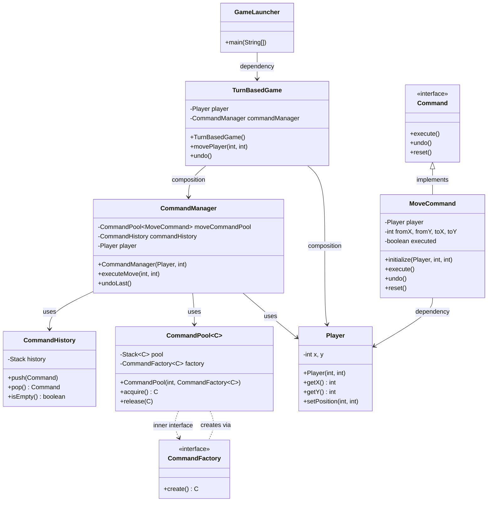

```mermaid
classDiagram
    class Command {
        <<interface>>
        +execute()
        +undo()
        +reset()
    }

    class MoveCommand {
        -Player player
        -int fromX, fromY, toX, toY
        -boolean executed
        +initialize(Player, int, int)
        +execute()
        +undo()
        +reset()
    }

    class CommandHistory {
        -Stack<Command> history
        +push(Command)
        +pop() Command
        +isEmpty() boolean
    }

    class CommandPool~C~ {
        -Stack~C~ pool
        -CommandFactory~C~ factory
        +CommandPool(int, CommandFactory~C~)
        +acquire() C
        +release(C)
    }

    class CommandManager {
        -CommandPool~MoveCommand~ moveCommandPool
        -CommandHistory commandHistory
        -Player player
        +CommandManager(Player, int)
        +executeMove(int, int)
        +undoLast()
    }

    class TurnBasedGame {
        -Player player
        -CommandManager commandManager
        +TurnBasedGame()
        +movePlayer(int, int)
        +undo()
    }

    class Player {
        -int x, y
        +Player(int, int)
        +getX() int
        +getY() int
        +setPosition(int, int)
    }

    class GameLauncher {
        +main(String[])
    }

    Command <|-- MoveCommand : implements
    CommandManager --> CommandPool~MoveCommand~ : uses
    CommandManager --> CommandHistory : uses
    CommandManager --> Player : uses
    TurnBasedGame --> CommandManager : composition
    TurnBasedGame --> Player : composition
    GameLauncher --> TurnBasedGame : dependency
    MoveCommand --> Player : dependency
    CommandPool~C~ ..> CommandFactory : inner interface

    class CommandFactory~C~ {
        <<interface>>
        +create() C
    }
    CommandPool~C~ .. CommandFactory~C~ : creates via
```
